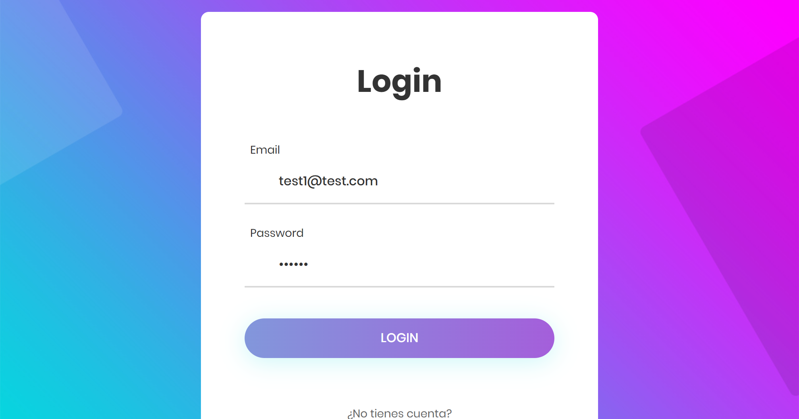

# AngularAuthApp

## Descripción 📖

Aplicación en Angular que se encarga de registrar usuarios en base de datos, así mismo permite iniciar sesión a los usuarios registrados, la página utilizara **guards** para proteger rutas y módulos de los usuarios no registrados.

El backend esta realizado con Node y MongoDB [repositorio](https://github.com/czabala847/mean-auth-server).

## Competencias adquiridas 🕹

- Rutas y LazyLoad
- Páginas protegidas con guard **CanActive** y **CanLoad**
- Validación de token
- Guardar token en localstorage

## Tecnologias utilizadas 💻

- [Angular](https://angular.io/) versión 14.0.0
